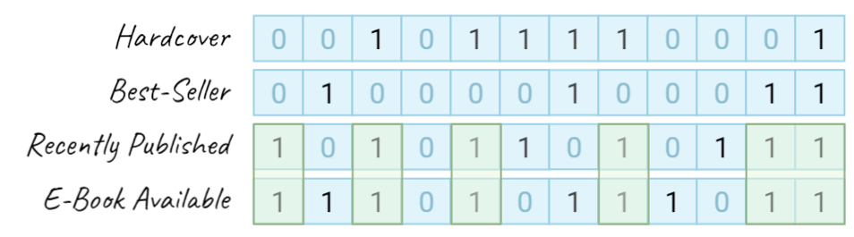

Besides working on the new experimentation platform in Careem, over the past few weekends I've been toying with building a high-performance columnar, in-memory store in Go.

<p align="center">
    <a href="http://github.com/kelindar/column">
        
    </a>
</p>

Most importantly, I wondered if it is possible to build a **nice API** while having data laid out in a very cache-friendly way and support indexing. In addition, most of columnar data stores are designed primarily for OLAP and there's not too many OLTP or HTAP stores built in a columnar fashion so can we build something for OLTP?

In one of my benchmarks, I've loaded in **20,000,000** documents each having a dozen attributes and run an indexed query trying to count certain rows, resulting in *1.3 million** entries counted and the query only took **half a millisecond**. And no, this is no fancy hardware but a simple desktop and the benchmark run on a single core.

On the same 20 million rows, **searching and updating around 6 million** rows takes about **100 milliseconds**. So both updates and queries are pretty fast, making the store useful for hybrid transactional and analytical processing (HTAP).

<p align="center">
    
</p>

## Design Decisions

In order to achieve this, the implementation leverages modern columnar design and some optimizations specifically for Go.

 * By arranging data in a columnar data layout it **minimizes cache-misses** and makes your CPU significantly more efficient. Your L1 cache is much faster than your L3 or your main memory, so when performing scans over predicate (e.g. "where clause") or comparing indexes, the database incurs significantly less cache misses.
 * In Go, the library was optimized for **zero heap allocation** during querying. This essentially pushes most of memory allocations in hot path onto stack and transactions are pooled and their memory re-used from the heap without allocating new one. Not only this is faster but it will also reduce GC pressure and will improve overall latency when operating it.
 * Support for **SIMD-enabled filtering** (i.e. "where" clause) by leveraging bitmap indexing, one of the things I wanted to explore. More details can be found below but this allows for very efficient columnar querying when accelerated by AVX2, AVX512 vectorized instructions.
 * Support for **columnar projection** (i.e. "select" clause) allows the store only touch the columns that are needed by the query. For example if you select "name" and "balance" of users, there's no need to load and decode the rest of attributes, only what you need.
 * Support for **computed indexes** that are dynamically calculated based on provided predicate to enable to actually build bitmap indexes for more complex, non binary columns. For example if you have an "age" column, you can bucket users into "young", "middle_aged" and "old" indexes which build bins based on the value. When querying, first filter of the bucket will narrow down the search space and a full scan can be performed on the rest.
 * Support for **transaction isolation**, allowing you to create transactions and commit/rollback. Currently the transaction isolation is protected by a global read-write lock in a strategy somewhat similar to an OCC (optimistic concurrency control), but I've been exploring having a sharded mutex for a cursor stability isolation level instead.
 * Support for **expiration** of rows based on time-to-live or expiration column. This is just a must in a modern DBMS, who wants to write those cleanup jobs manually?
 * Support for **atomic increment/decrement** of numerical values in a transaction. This is just a first logical operations, but I'm thinking of supporting more.
 * Support for **change data stream** that streams all commits consistently and which would allow me to implement a write-ahead log (WAL) along with snapshotting and recovery. In fact, there's also a replay mechanism on the store allowing for replaying those commits and creating a replica.

After exploring and building all of that, and achieving performance levels I'm quite happy with, there's still quite a lot more to do. Next steps are adding frame-of-reference column compression, database cracking, and figuring out multi-core scaling allowing for more concurrent updates with cursor stability isolation level. Next couple of sections goes into the bitmap indexing, which allowed this store to perform fast queries.

```go
// Create the index "rogue"
players.CreateIndex("rogue", "class", func(v interface{}) bool {
	return v == "rogue"
})

// This counts all of the rogues by using a bitmap index
players.Query(func(txn *column.Txn) error {
	count := txn.With("rogue").Count()
	return nil
})
```

## Bitmap Indexing

The general idea of my bitmap package is to have a dead simple way of creating bitmaps (bitsets) that provide maximum performance on the modern hardware by using vectorized single-instruction multiple data (SIMD) operations. As opposed to something as roaring bitmaps which are excellent for sparse data, this implementation is designed to be used for small or medium dense bit sets. I'd like to specifically point out the indexing part and how bitmaps can be used as a good alternative to B*Trees and Hash Maps which are most commonly used techniques in current databases.

How does such bitmap index works? Let's imagine that we have a dataset containing books, and four bitmaps defining one of the four properties of each book. In the figure below, you can imagine that our books can be on "columns" and each bit in a bitmap defines whether this attribute exists on a book or not.

Now, if we want to find all books that were recently published and have an e-book available, we can use an and method on our two bitmaps in order to combine them. In the example below we retrieve 3 hypothetical bitmaps and combine them to answer our query by calling and and method to mutate the books bitmap twice.

<p align="center">
    
</p>

Now, what if we want to find recently published books which has e-book available but are not best-sellers? In that case, we could use binary and not operation that hardware exposes. In the example below we combine


<p align="center">
    
</p>

## Faster Bitmaps with SIMD

Now wait, what if we have 10 million rows, aren't our bitmaps are going to get slow? Not quite, since they are nicely fitting on the cache-line and minimize cache misses they will perform extremely well even if they are relatively large. But on modern hardware, we can do better.

Enter single instruction multiple data (SIMD) which allows us to perform operations on large registers, and in Go, we can use the Plan9 assembly to write this part and which I nicely abstracted in the [bitmap package](https://github.com/kelindar/bitmap).

```
// func x64and(a []uint64, b []uint64)
// Requires: AVX, AVX2
TEXT ·x64and(SB), NOSPLIT, $0-48
	MOVQ a_base+0(FP), AX
	MOVQ b_base+24(FP), CX
	MOVQ b_len+32(FP), DX
	XORQ BX, BX

	// perform vectorized operation for every block of 512 bits
body:
	CMPQ DX, $0x00000008
	JL   tail

	// perform the logical "AND" operation
	VMOVUPD (CX), Y0
	VMOVUPD 32(CX), Y1
	VPAND   (AX), Y0, Y0
	VPAND   32(AX), Y1, Y1
	VMOVUPD Y0, (AX)
	VMOVUPD Y1, 32(AX)

	// continue the interation by moving read pointers
	ADDQ $0x00000040, AX
	ADDQ $0x00000040, CX
	SUBQ $0x00000008, DX
	JMP  body

tail:
	... // do the tail

done:
	RET
```

