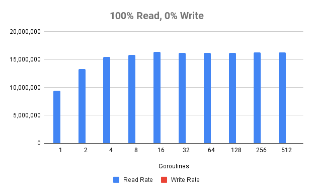
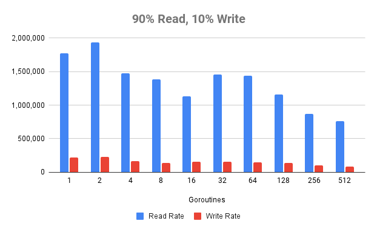
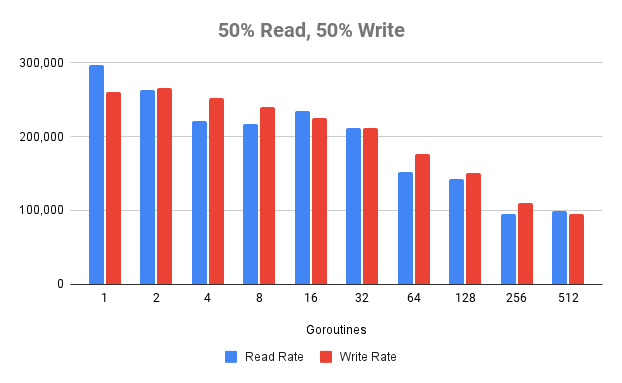
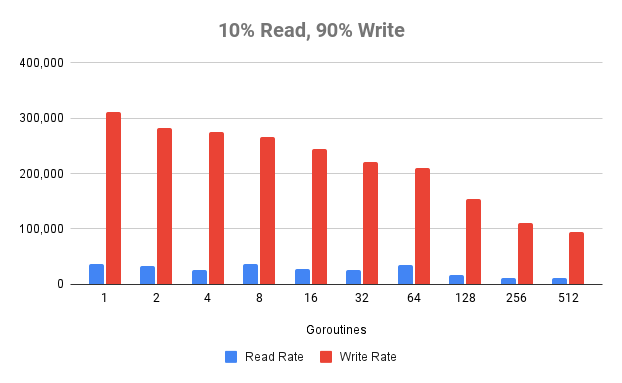

In the recent months, I've been working on a side-project of mine where I'm trying to build a high-performance, in-memory columnar datastore - [kelindar/column](https://github.com/kelindar/column). One of the initial builds had a huge lock around the every update and read, which is not really scalable since it's rather prone to lock contentions.

I've improved recently by introducing a sharded mutex, essentially an array of 128 locks with some padding around them to avoid false sharing. Then, the hard part was to actually benchmark it, as it required randomness and eliminating any other probe-efects induced by the benchmark itself. After a few hours of playing with it, I've got some results and wanted to write a short summary about it.

## Benchmark Setup

The benchmark itself can be found [in the examples/bench](https://github.com/kelindar/column/tree/main/examples/bench) folder of the [repo](https://github.com/kelindar/column)

This is an example benchmark with various workloads (90% read / 10% write, etc) on a collection of 1 million elements with different goroutine pools. In this example we're combining two types of transactions:
 * Read transactions that update a random element (point-read).
 * Write transactions that update a random element (point-write).

Note that the goal of this benchmark is to validate concurrency, not throughput this represents the current "best" case scenario when the updates are random and do less likely to incur contention. Reads, however quite often would hit the same chunks as only the index itself is randomized.

## Results

Below are some results from running on my 8-core machine (Intel(R) Core(TM) i7-9700K CPU @ 3.60GHz).







```
   WORK  PROCS          READ RATE          WRITE RATE
100%-0%      1    8,149,482 txn/s             0 txn/s
100%-0%      2   12,622,747 txn/s             0 txn/s
100%-0%      4   14,378,647 txn/s             0 txn/s
100%-0%      8   16,298,860 txn/s             0 txn/s
100%-0%     16   16,276,835 txn/s             0 txn/s
100%-0%     32   16,297,247 txn/s             0 txn/s
100%-0%     64   16,214,731 txn/s             0 txn/s
100%-0%    128   16,185,721 txn/s             0 txn/s
100%-0%    256   16,171,638 txn/s             0 txn/s
100%-0%    512   16,237,574 txn/s             0 txn/s
90%-10%      1    2,248,513 txn/s       239,309 txn/s
90%-10%      2    2,297,998 txn/s       226,016 txn/s
90%-10%      4    1,432,691 txn/s       184,189 txn/s
90%-10%      8    1,112,076 txn/s       153,934 txn/s
90%-10%     16    1,432,723 txn/s       147,244 txn/s
90%-10%     32    1,375,383 txn/s       161,755 txn/s
90%-10%     64    1,441,755 txn/s       144,570 txn/s
90%-10%    128    1,272,174 txn/s       140,107 txn/s
90%-10%    256      925,191 txn/s       105,999 txn/s
90%-10%    512      858,555 txn/s        89,202 txn/s
50%-50%      1      305,245 txn/s       320,159 txn/s
50%-50%      2      262,496 txn/s       250,654 txn/s
50%-50%      4      255,906 txn/s       262,823 txn/s
50%-50%      8      238,096 txn/s       225,565 txn/s
50%-50%     16      236,144 txn/s       240,810 txn/s
50%-50%     32      250,954 txn/s       237,928 txn/s
50%-50%     64      214,474 txn/s       220,495 txn/s
50%-50%    128      156,660 txn/s       162,219 txn/s
50%-50%    256      125,956 txn/s       120,344 txn/s
50%-50%    512      103,619 txn/s        98,510 txn/s
10%-90%      1       40,723 txn/s       339,694 txn/s
10%-90%      2       24,746 txn/s       298,934 txn/s
10%-90%      4       35,483 txn/s       290,769 txn/s
10%-90%      8       34,265 txn/s       279,838 txn/s
10%-90%     16       28,678 txn/s       274,759 txn/s
10%-90%     32       23,662 txn/s       227,651 txn/s
10%-90%     64       36,056 txn/s       208,993 txn/s
10%-90%    128       17,463 txn/s       149,558 txn/s
10%-90%    256       14,125 txn/s       113,701 txn/s
10%-90%    512       11,435 txn/s        96,999 txn/s
0%-100%      1            0 txn/s       345,335 txn/s
0%-100%      2            0 txn/s       297,386 txn/s
0%-100%      4            0 txn/s       300,023 txn/s
0%-100%      8            0 txn/s       276,361 txn/s
0%-100%     16            0 txn/s       243,448 txn/s
0%-100%     32            0 txn/s       208,523 txn/s
0%-100%     64            0 txn/s       195,732 txn/s
0%-100%    128            0 txn/s       145,990 txn/s
0%-100%    256            0 txn/s       110,786 txn/s
0%-100%    512            0 txn/s        94,313 txn/s
```